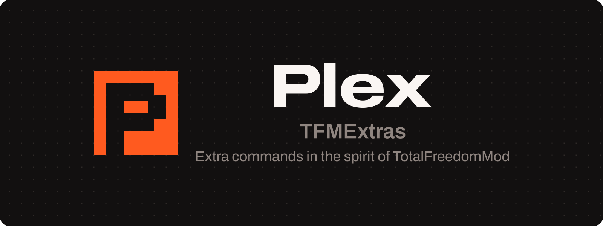

# Module-TFMExtras 

Module-TFMExtras adds extra commands to Plex in the spirit of TotalFreedomMod.

Read the documentation at [plex.us.org/modules/tfmextras](https://plex.us.org/modules/tfmextras).

**Note:** Do not use any code licensed under the TotalFreedom General License in this project. It is not allowed.
